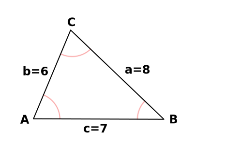

# trig

A Clojure(Script) library for solving triangles.

## Installation ##
Add the following dependency to your `project.clj` file

```clojure
[trig "0.1.1-SNAPSHOT"]
```

## Usage
`trig` exposes 2 functions, `trig/solve` and `trig/solve-right`. These provide a simple interface for solving the sides and angles of triangles.

`trig/solve` will solve any triangle given a map with any combo of 3 sides and/or angles.

`trig/solve-right` will solve any right triangle given a map with any combo of 2 sides and/or angles.

Side values are supplied with the keys `:a :b :c`, and their respective opposing angles are supplied with the keys `:A :B :C`. The angle values must be given in degrees.

<p align="left"></p>

```clojure
(trig/solve {:b 5 :A 49 :c 7})
;; => {:b 5 :c 7 :a 5.298666621959197 :B 45.41169386690557 :C 85.58830613309442 :A 49 :type :SAS}
```
&nbsp;
<p align="left"></p>

```clojure
(trig/solve {:a 18.9 :B 87 :C 42})
;; => {:b 24.28642641528604 :c 16.27309294186255 :a 18.9 :B 87 :C 42 :A 51 :type :ASA})
```
&nbsp;
<p align="left"></p>

```clojure
(trig/solve {:b 6 :c 7 :a 8})
;; => {:b 6 :c 7 :a 8 :A 75.52248781407008 :B 46.56746344221023 :C 57.9100487437197 :type :SSS})
```
&nbsp;

For solving right triangles, only 2 of the following keys are required:
`:a, :b, :c, :A, :B`
The side :c must always be the hypotenuse (the longest side), and the value of the implied angle `:C` will always be 90.

<p align="left"></p>

```clojure
(trig/solve-right {:b 7 :c 10})
;; => {:c 10 :b 7 :a 7.1414284285428495 :C 90 :B 44.4270040008057 :A 45.5729959991943}
```
&nbsp;

Both `trig/solve` or `trig/solve-right` will take an optional second argument, which will return the value for the specific side or angle you desire. This argument must be `:a`, `:b`, `:c`, `:A`, `:B`, or `:C`.

```clojure
(trig/solve-right {:b 7 :c 10} :a))
;; => 7.1414284285428495
```

## License

Copyright © 2019 JC

This program and the accompanying materials are made available under the
terms of the Eclipse Public License 2.0 which is available at
http://www.eclipse.org/legal/epl-2.0.

This Source Code may also be made available under the following Secondary
Licenses when the conditions for such availability set forth in the Eclipse
Public License, v. 2.0 are satisfied: GNU General Public License as published by
the Free Software Foundation, either version 2 of the License, or (at your
option) any later version, with the GNU Classpath Exception which is available
at https://www.gnu.org/software/classpath/license.html.
